<picture>
  <source media="(prefers-color-scheme: light)" srcset="assets/banner.svg">
  
</picture>

# Kimaya Chavan

### Robotics Perception Engineer in Training

  <strong>One-line pitch:</strong> Building real-time perception systems at the intersection of computer vision, deep learning and ROS 2 — seeking internships in robotics perception and CV.

  <!-- Links row -->
  <a href="https://github.com/kimiko-11">GitHub</a> ·
  <a href="mailto:hellokimaya@gmail.com">Email</a> ·
  <a href="https://www.linkedin.com/in/kimaya-chavan">LinkedIn</a> ·
  <!-- TODO: add resume URL --> Resume

---

## Featured projects

> Quick: 30-second scan — three projects (placeholders). Do NOT invent details; replace the TODOs below.

| Demo | Problem (one line) | Tech | Result |
| ---: | --- | --- | --- |
|  <!-- TODO: add demo image (GIF/PNG) and alt text --> | <!-- TODO: one-line problem statement --> | <!-- TODO: e.g. Python, ROS2, OpenCV, PyTorch --> | <!-- TODO: measurable result (accuracy / latency / dataset size) --> |
|  <!-- TODO --> | <!-- TODO --> | <!-- TODO --> | <!-- TODO --> |
|  <!-- TODO --> | <!-- TODO --> | <!-- TODO --> | <!-- TODO --> |

---

<picture>
  <source media="(prefers-color-scheme: light)" srcset="assets/learning-pipeline.svg">
  
</picture>

---

## Tech Stack

_Lightweight neon badges — readable in dark and light mode._

**Languages**

Python · C++ · C · Embedded C · Java

**Robotics & Vision**

ROS 2 · OpenCV · NumPy · Pandas · scikit-learn

**Tools & Hardware**

Git · Ubuntu · VS Code · Arduino · ESP8266

---

## Education

- D.J. Sanghvi College of Engineering (DJSCE)
- B.Tech — Artificial Intelligence & Data Science — Final year
- CGPA: 9.55

**Currently exploring:** robotics perception, LiDAR & sensor fusion, ROS 2 pipelines, and deployable embedded models.

---

## Live stats & activity

<!-- Self-hosted SVGs generated by Actions into assets/ -->

 <!-- alt: language breakdown generated by workflow -->
 <!-- alt: self-hosted streak card -->
 <!-- alt: commits summary card -->

 <!-- alt: neon contribution snake generated by Platane/snk -->

<!--START_ACTIVITY-->
<!-- TODO: optional auto-updated activity block; replace with workflow output -->
<!--END_ACTIVITY-->

---

## Get in touch

- Email: [hellokimaya@gmail.com](mailto:hellokimaya@gmail.com)
- GitHub: [kimiko-11](https://github.com/kimiko-11)
- LinkedIn: [kimaya-chavan](https://www.linkedin.com/in/kimaya-chavan)

---

## Maintenance & checklist

- [ ] Add resume link
- [ ] Replace project placeholders and demo images (assets/project*-demo.*)
- [ ] Verify generated SVGs render well in GitHub dark and light themes
- [ ] If you enable the activity workflow, add the required repo permissions and test the update
- [ ] (Optional) Review and tune workflow schedules

<!-- README produced/updated by repository assistant. -->
